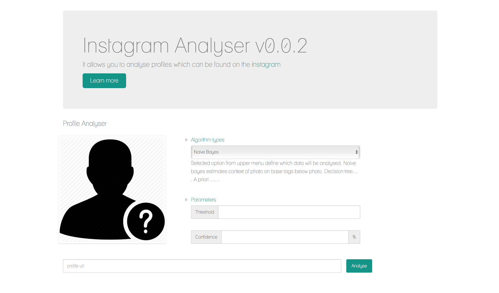

# Instagram Analyser



### Introduction
...

### Algorithms and parameters:

...
### Application flow diagram


### Debug endpoints


Content of instagram profile after extracting proceses:
```
http://localhost:8282/debug/profile/web?url=<profileUrl>
```

Raw version of instagram profile:
```
http://localhost:8282/debug/profile/raw?url=<profileUrl>
```

Instagram profile from ElasticSearch (soon):
```
http://localhost:8282/debug/profile/es?url=<profileUrl>
```

Media details from instagram endpoint:
```
http://localhost:8282/debug/media/raw?shorcode=<mediaShortCode>
```

Application healthcheck:
```
http://localhost:8282/debug/healthcheck
```


### Technologies

- Spring MVC
- Maven
- Tomcat
- Project Lombok
- JSoup
- Java Tuples
- Google Guava
- Apache Commons
- JSP
- JSLT
- Bootstrap
- Log4j
- Jackson
- Docker Maven Plugin
- ElasticSearch
- JUnit
- Mockito

### Metrics
...

### Running locally
...

### Testing locally
...

